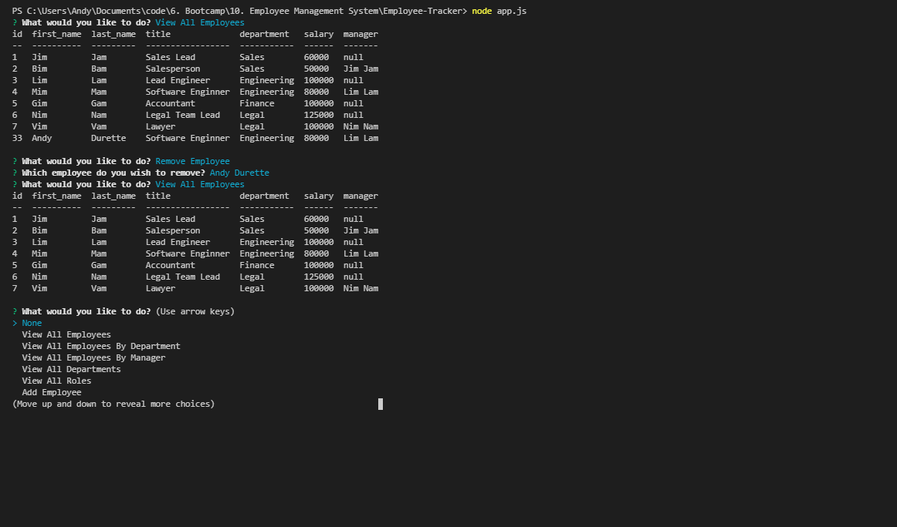

# Employee-Tracker

Assignment 10 for University of Toronto coding bootcamp.

This assignment focused on creating a **C**ontent **M**anagement **S**ystem solution. 

Here I built a solution for managing a company's employees using node, inquirer, and MySQL.

The capabilities built in are.

1. View All Employees
2. View All Employees By Department
3. View All Employees By Manager
4. View All Departments
5. View All Roles
6. Add Employee
7. Add Role
8. Add Department
9. Remove Employee
10. Update Employee Role

To run the application on your local a sql setup file has been included named createEmployees.sql.

A video of the cli in motion below found at the link below and below it a screenshot of the cli in use.
https://drive.google.com/file/d/1SIdJjIhWDRnxEGrPj_rDyBEmnjWEYh57/view

